# Ejercicio 1 IAW
- 1.	**Vamos a crear un nuevo repositorio llamado prueba2_tu_nombre. Ten en cuenta lo siguiente:**

  

- 2.	**En esta ocasión, crea primero el repositorio local en Windows (usando git init). El repositorio debe contener, al menos, dos archivos de texto: archivo1.txt y archivo2.txt. El contenido de ambos archivos es libre.**

Creo el directorio y pongo el "git init"

  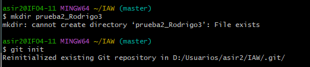
  
  Creo los dos archivos

  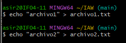

  Los añado con "git add"

  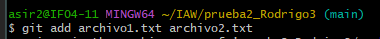

  Acabo con "git commit" para confirmar que lo he hecho

 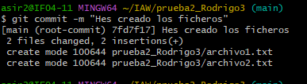

- 3. **Agrega (conecta) el repositorio local con un repositorio remoto en GitHub (usando git remote add).**

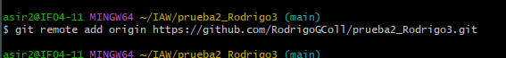

- 4.	**Sube el repositorio local a GitHub (usando git push).**

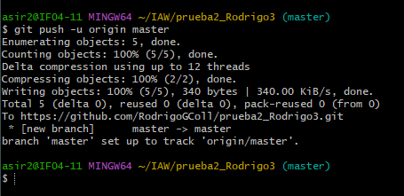

- 5. **Clona el repositorio remoto en tu máquina virtual Linux Debian (usando git clone)**

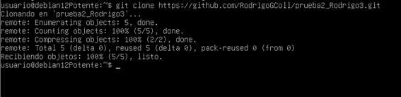

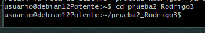

- 6. **Modifica, en Windows, uno de los archivos y añade un 3º archivo de texto llamado archivo3.txt. Confirma los cambios(usando git add, git commit) y súbelos al repositorio (usando git push)** 

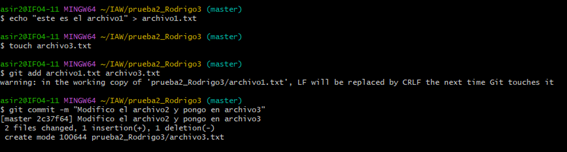

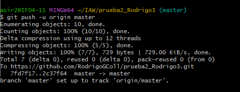

- 7. **o	Actualiza la versión local del repositorio en Linux Debian (usando git pull).**

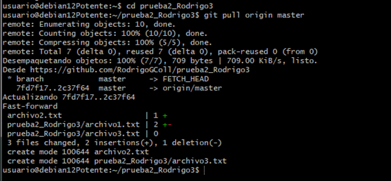