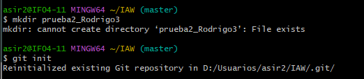

Rodrigo Gonzalez
# Título Principal

## Subtítulo

Este es un párrafo con **negrita**, *cursiva*, y `esto está escrito en código`.

```bash
touch "Hola Luis"
```
# Lista ordenada
1. Primer elemento de lista ordenada
2. Segundo elemento de lista ordenada
3. Tercer elemento de lista ordenada
# Lista desordenada
- Un elemento
- Otro elemento 
- Otro elemento
# Un enlace a una URL externa.
[Enlace a una URL externa](https://www.github.com)
# Enlace a otro fichero md
[Enlace a otro fichero Markdown](./Ejercicio1.md)
# imagen

# Una tabla
| Encabezado 1 | Encabezado 2 | Encabezado 3 |
| ------------ | ------------ | ------------ |
| Fila 1 Col 1 | Fila 1 Col 2 | Fila 1 Col 3 |
| Fila 2 Col 1 | Fila 2 Col 2 | Fila 2 Col 3 |